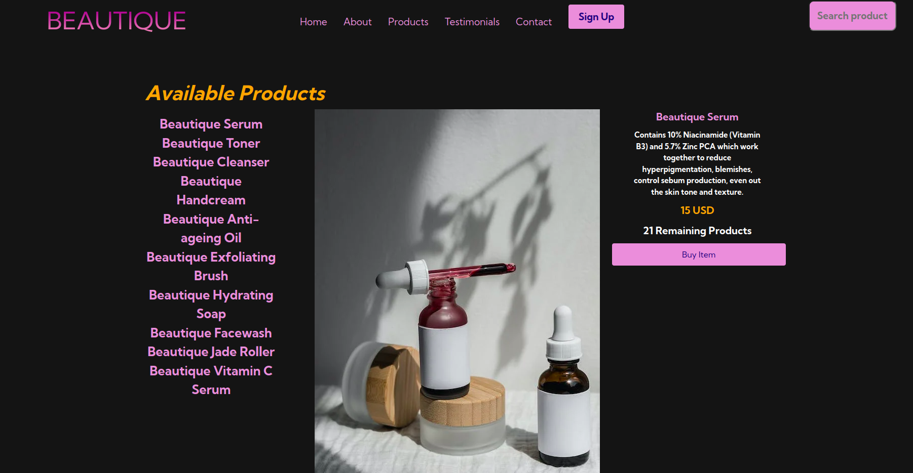

# BEAUTIQUE SKINCARE PRODUCTS
My goal was to design an organic skincare products website using HTML, CSS, javaScript and Bootstrap.

# Prerequisites
Create a repository on your GitHub account.
Create a HTML document and style it using CSS
Link bootstrap and fontawesome 
Use JavaScript to add interactivity.
Fetch, patch and post data from JSON or a public API

# Project Setup
Built with;
HTML
CSS
Bootstrap 
javaScript 

## Core Deliverables 
The user can see product list when the page loads and once an item on the list is selected it displays the image of the product in the middle column, the product description, price and quantiy on the right column. The next item clicked replaces the current displayed item's details.

A GET request is made to the external JSON file linked using Railway to retrieve the product data.
Product purchase is achieved after clicking the "Buy Product" button, the number of available tickets decreases in the front end with every purchase.

Purchase should not be able to be made if it is showing products are sold out (if there are 0 products remaining). 

Some features are yet to be updated seeing as this was a one page only project.

 

## Author 
Linet Oliech was the sole contributor to this project. In case of any inquiries or contributions, be sure to email me at oliechlin@gmail.com @QuincyOliech